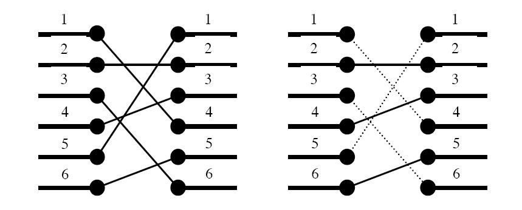

### Problem Description
'Oh no, they've done it again', cries the chief designer at the Waferland chip factory. Once more the routing designers have screwed up completely, making the signals on the chip connecting the ports of two functional blocks cross each other all over the place. At this late stage of the process, it is too expensive to redo the routing. Instead, the engineers have to bridge the signals, using the third dimension, so that no two signals cross. 

However, bridging is a complicated operation, and thus it is desirable to bridge as few signals as possible. The call for a computer program that finds the maximum number of signals which may be connected on the silicon surface without rossing each other, is imminent. Bearing in mind that there may be housands of signal ports at the boundary of a functional block, the problem asks quite a lot of the programmer. Are you up to the task?



### Input
On the first line of the input, there is a single positive integer n, telling the number of test scenarios to follow. Each test scenario begins with a line containing a single positive integer $p<40000$, the number of ports on the two functional blocks. Then follow $p$ lines, describing the signal mapping: On the $i$:th line is the port number of the block on the right side which should be connected to the $i$:th port of the block on the left side.

### Output
For each test scenario, output one line containing the maximum number of signals which may be routed on the silicon surface without crossing each other.

### Examples

#### input
```
4
6
4 2 6 3 1 5
10
2 3 4 5 6 7 8 9 10 1
8
8 7 6 5 4 3 2 1
9
5 8 9 2 3 1 7 4 6
```
#### output
```
3
9
1
4
```


### 题目大意
求LIS（最长递增子序列）的长度，要求在O(nlogn)时间内解出

### 算法思路
由于不需要输出序列，可以考虑如下解法：
用b[i]表示长度为i的LIS的末位的最小元素，blen为当前LIS的长度
先初始化b[1]=a[1],blen=1
遍历a数组，若a[i]大于b[blen]，即将a[i]加入b[++blen]
否则找到b[]中第一个大于a[i]的元素b[j]，将其更新为a[i]（即相当于在LIS：b[j-1]后接上a[i]）
最后，blen即为LIS长度